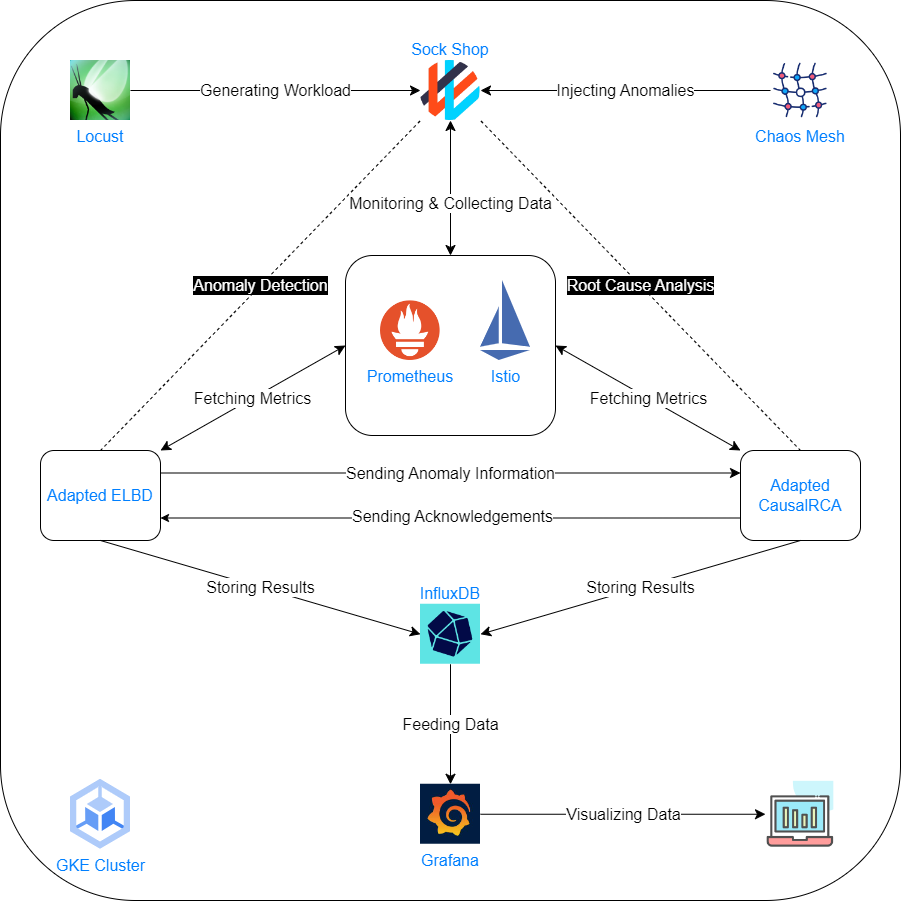

# An AIOps System



## Table of Contents

1. [GKE Cluster](#gke-cluster)
2. [Sock Shop](#sock-shop)
3. [Prometheus](#prometheus)
4. [Istio](#istio)
5. [Locust](#locust)
6. [Chaos Mesh](#chaos-mesh)
7. [InfluxDB](#influxdb)
8. [Adapted CausalRCA](#adapted-causalrca)
9. [Adapted ELBD](#adapted-elbd)
10. [Grafana](#grafana)

---

## GKE Cluster

Google's Kubernetes Engine (GKE) serves as the backbone of our AIOps system. For additional details, please visit [GKE's official documentation](https://cloud.google.com/kubernetes-engine).

### Cluster Basics

- **Location Type**: Zonal
- **Zone**: europe-west4-a
- **Control Plane Version**: Static version, 1.27.3-gke.100

### Node Pool

- **Size**: 4 nodes
- **Automation**: Disabled

### Node Configuration

- **Image Type**: Container-Optimized OS with containerd
- **Machine Configuration**: 
  - Series: E2
  - Machine Type: e2-standard-4 (2 vCPU, 1 core, 8 GB memory)
- **Disk**:
  - Type: Balanced persistent disk
  - Size: 50 GB

### Security

- **Access Scopes**: Full access to all Cloud APIs

### Cluster Automation

- Disabled

### Additional Features

- **Operations**: 
  - Logging
  - Cloud Monitoring
  - Managed Service for Prometheus
- **Miscellaneous**:
  - Cost Allocation
  - Compute Engine Persistent Disk CSI Driver

---

## Sock Shop

Sock Shop is our test application. More details can be found [here](https://microservices-demo.github.io/).

**Deployment:**
```bash
kubectl apply -f sock-shop.yaml
```

**Access:**
- Access through the Frontend microservice via its external load balancer endpoint; in this project, it is: http://34.90.74.142:80

---

## Prometheus

Monitoring is handled by [Prometheus](https://prometheus.io/). Install kube-prometheus-stack through the Helm chart. Check the [official documentation](https://github.com/prometheus-community/helm-charts/tree/main/charts/kube-prometheus-stack) for more information.

**Add Helm Repository and Update:**
```bash
helm repo add prometheus-community https://prometheus-community.github.io/helm-charts
helm repo update
```

**Installation:**
```bash
helm install [RELEASE_NAME] prometheus-community/kube-prometheus-stack
```
Note: in this project, the release name is set to be 'octopus'.

**Access Prometheus Web UI on a Local Host:**
```bash
kubectl port-forward svc/octopus-kube-prometheus-st-prometheus 9090
```

**Web UI**: http://localhost:9090

---

## Istio

Istio is used for capturing the metric of response time between microservices. Installation is through Helm. Detailed information can be found at [Istio's official website](https://istio.io/).

**Add Helm Repo and Update:**
```bash
helm repo add istio https://istio-release.storage.googleapis.com/charts
helm repo update
```

**Installation Steps:**
1. **Create Namespace**:
    ```bash
    kubectl create namespace istio-system
    ```

2. **Install Base Chart**:
    ```bash
    helm install istio-base istio/base -n istio-system --set defaultRevision=default
    ```

3. **Install Discovery Chart**:
    ```bash
    helm install istiod istio/istiod -n istio-system --wait
    ```

**Label Sock Shop namespace for Istio:**
```bash
kubectl label namespace sock-shop istio-injection=enabled
```

**Restart Sock Shop Pods:**
```bash
kubectl rollout restart deployment -n sock-shop
```

**Integrate with Prometheus:**
```bash
helm upgrade octopus prometheus-community/kube-prometheus-stack -f prometheus-values.yaml
```

---

## Locust

Locust is utilized for generating workload. Its installation is done through Helm. More info is available at [Locust's homepage](https://locust.io/).

**Write Load Tests:**
- In `locustfile.py`

**Installation Steps:**

1. **Create ConfigMap:**
    ```bash
    kubectl create configmap my-loadtest-locustfile --from-file=locustfile.py
    ```
  
2. **Add Helm Repository and Update:**
    ```bash
    helm repo add deliveryhero https://charts.deliveryhero.io/
    helm repo update
    ```
  
3. **Local Access:**
    - Install with `cluster-ip-values.yaml`:
        ```bash
        helm install dolphin deliveryhero/locust -f cluster-ip-values.yaml
        ```
        Note: 'dolphin' is the release name for Locust in this project.
    - Forward the traffic:
        ```bash
        kubectl port-forward svc/dolphin-locust 8089:8089
        ```
    - Web UI: `http://localhost:8089`

4. **External Access:**
    - Install with `load-balancer-values.yaml`:
        ```bash
        helm install dolphin deliveryhero/locust -f load-balancer-values.yaml
        ```
    - Web UI: `http://34.91.160.140:8089`

**Load Test Parameters:**
- Number of users: 300
- Spawn rate: 10
- Host: `http://34.90.74.142:80`

---

## Chaos Mesh

Chaos Mesh is used for anomaly injection. Installation details can be found at [Chaos Mesh website](https://chaos-mesh.org/).

**Add Helm Repo and Update:**
```bash
helm repo add chaos-mesh https://charts.chaos-mesh.org
helm repo update
```

**Installation Steps:**
1. **Create Namespace**:
    ```bash
    kubectl create ns chaos-mesh
    ```

2. **Install Helm Chart**:
    ```bash
    helm install chaos-mesh chaos-mesh/chaos-mesh -n=chaos-mesh --set chaosDaemon.runtime=containerd --set chaosDaemon.socketPath=/run/containerd/containerd.sock --version 2.6.1 --set dashboard.securityMode=false
    ```
    Note: the chart is installed in the environment of containerd, disabling the safe mode to elevate permissions for chaos experiments

**Inject Anomalies:**
```bash
kubectl create -f chaos-mesh-pre-training.yaml
```
Note: this is a Chaos Mesh workflow intended for the anomaly injection of the pre-training process of the adapted ELBD. To inject anomalies for the purpose of testing the adapted ELBD online, create another workflow through:
```bash
kubectl create -f chaos-online.yaml
```

**Access Chaos Dashboard on a Local Host:**
```bash
kubectl port-forward -n chaos-mesh svc/chaos-dashboard 2333:2333
```
- Web UI: `http://localhost:2333`

---

## InfluxDB

InfluxDB stores metrics and results. More details can be found [here](https://www.influxdata.com/).

**Add Helm Repo and Update:**
```bash
helm repo add influxdata https://helm.influxdata.com/
helm repo update
```

**Installation:**
```bash
helm install seal influxdata/influxdb2 -f influxdb-values.yaml
```
Note: 'seal' is the release name here; the InfluxDB v2 chart is installed, with the custom values.

**Access InfluxDB on a Local Host:**
```bash
kubectl port-forward svc/seal-influxdb2 8086:80
```
- Web UI: `http://localhost:8086`
- Username: `adminuser`
- Password: `adminuser`
- Create two buckets named `ELBD` and `CausalRCA`, respectively

### Querying InfluxDB:

#### For ELBD Results:
```flux
from(bucket: "ELBD")
    |> range(start: -1h)
    |> filter(fn: (r) => r._measurement == "elbd_results")
    |> filter(fn: (r) => r._field == "anomaly")
```

#### For CausalRCA Results (Coarse-Grained):
```flux
from(bucket: "CausalRCA")
    |> range(start: -1h)
    |> filter(fn: (r) => r._measurement == "causalrca_results")
    |> filter(fn: (r) => r._field == "metric" or r._field == "score")
    |> filter(fn: (r) => r["granularity"] == "coarse")
    |> pivot(rowKey:["_time"], columnKey: ["_field"], valueColumn: "_value")
```

#### For CausalRCA Results (Fine-Grained):
```flux
from(bucket: "CausalRCA")
    |> range(start: -1h)
    |> filter(fn: (r) => r._measurement == "causalrca_results")
    |> filter(fn: (r) => r._field == "metric" or r._field == "score")
    |> filter(fn: (r) => r["granularity"] == "fine")
    |> pivot(rowKey:["_time"], columnKey: ["_field"], valueColumn: "_value")
```

---

## Adapted CausalRCA

**Deploy the adapted CausalRCA first to set up an HTTP server that will listen for incoming requests from the adapted ELBD.**

CausalRCA is tailored for root cause analysis. The original codebase can be found [here](https://github.com/AXinx/CausalRCA_code).

**Build Docker Image:**
```bash
docker build -t adapted_causalrca .
```

**Tag the Image:**
```bash
docker tag adapted_causalrca hyluvavu/adapted_causalrca:latest
```

**Push the Image:**
```bash
docker push hyluvavu/adapted_causalrca:latest
```

**Deploy in GKE:**
```bash
kubectl apply -f adapted-causalrca.yaml
```

---

## Adapted ELBD

**Deploy the adapted ELBD only after the adapted CausalRCA is up and running.**

ELBD is customized for anomaly detection. The original codebase can be found [here](https://github.com/AXinx/ELBD).

**Build Docker Image:**
```bash
docker build -t adapted_elbd .
```

**Tag the Image:**
```bash
docker tag adapted_elbd hyluvavu/adapted_elbd:latest
```

**Push the Image:**
```bash
docker push hyluvavu/adapted_elbd:latest
```

**Deploy in GKE:**
```bash
kubectl apply -f adapted-elbd.yaml
```

---

## Grafana

Grafana is used for dashboarding and visualization. More details at [Grafana's website](https://grafana.com/). Once the kube-prometheus-stack is set up, Grafana comes pre-installed.

**Access Grafana UI on a Local Host:**
```bash
kubectl port-forward svc/octopus-grafana 3000:80
```
- Web UI: `http://localhost:3000`
- Username: `admin`
- Password: `prom-operator`

In the Grafana web UI:
- Add InfluxDB as a data source
- Build a dashboard for InfluxDB; alternatively, import a dashboard created earlier

### Querying InfluxDB from Grafana:

#### For ELBD Results:
```flux
from(bucket: "ELBD")
    |> range(start: -1h)
    |> filter(fn: (r) => r._measurement == "elbd_results")
    |> filter(fn: (r) => r._field == "anomaly")
```

#### For CausalRCA Results (Coarse-Grained):
**Note the addition of a Grafana dashboard variable `anomaly_time_variable`.**
```flux
from(bucket: "CausalRCA")
    |> range(start: -1h)
    |> filter(fn: (r) => r._measurement == "causalrca_results")
    |> filter(fn: (r) => r._field == "metric" or r._field == "score")
    |> filter(fn: (r) => r["anomaly_time"] == "${anomaly_time_variable}")
    |> filter(fn: (r) => r["granularity"] == "coarse")
    |> pivot(rowKey:["_time"], columnKey: ["_field"], valueColumn: "_value")
```

#### For CausalRCA Results (Fine-Grained):
**Note the addition of a Grafana dashboard variable `anomaly_time_variable`.**
```flux
from(bucket: "CausalRCA")
    |> range(start: -1h)
    |> filter(fn: (r) => r._measurement == "causalrca_results")
    |> filter(fn: (r) => r._field == "metric" or r._field == "score")
    |> filter(fn: (r) => r["anomaly_time"] == "${anomaly_time_variable}")
    |> filter(fn: (r) => r["granularity"] == "fine")
    |> pivot(rowKey:["_time"], columnKey: ["_field"], valueColumn: "_value")
```

---

## Conclusion

You have reached the end of this documentation. For any further queries or issues, please refer to the respective component's official documentation or reach out for support.
